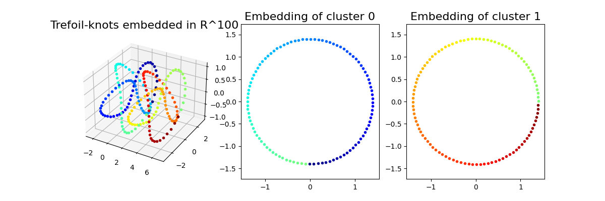
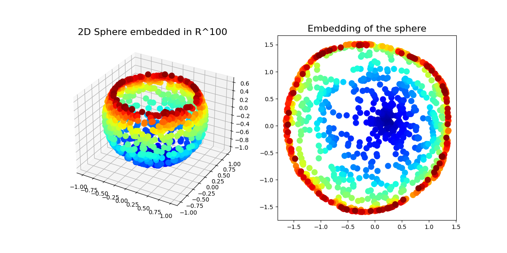

# smce
Python implementation of [**Sparse Manifold Clustering and Embedding**](https://proceedings.neurips.cc/paper_files/paper/2011/file/fc490ca45c00b1249bbe3554a4fdf6fb-Paper.pdf)

- Elhamifar, Ehsan, and René Vidal. "Sparse manifold clustering and embedding." Advances in neural information processing systems 24 (2011).

This implementation is based on [Matlab Code for SMCE](http://www.vision.jhu.edu/code/fetchcode.php?id=5) provided by [JHU Vision Lab](http://vision.jhu.edu/code/)

## Requirements
- matplotlib
- numpy
- sklearn
- scipy

## Usage
### Synthetic Experiments in paper
#### 1. two trefoil-knots
```python
python main.py 2refoils
```


#### 2. punctured sphere
```python
python main.py sphere
```



Discussions and feedback are always welcome! 